#Tạo database 

Vào hệ quản trị SQL SERVER, tải tập tin QuanLyGiaoVien.sql có đính kèm sẵn tô đen hết tấc cả các dòng còn lạinhấn phím F5 hoặc nhấn vào ô "Execute"

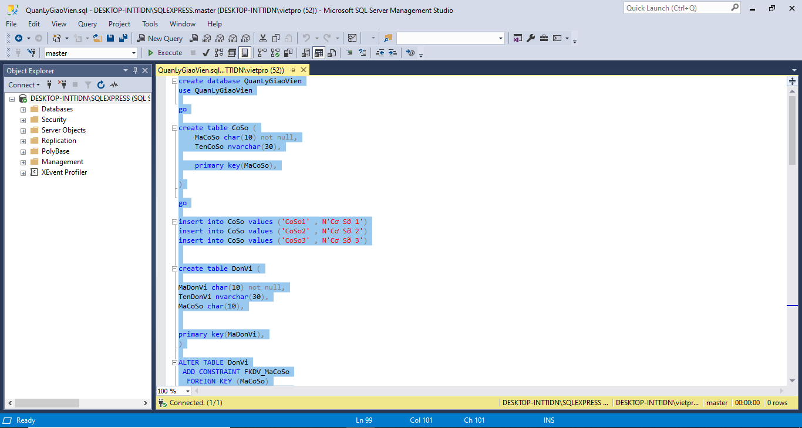

Tạo tài khoản username và password để có thể truy cập vào database:

Vào Security -> Chọn Login -> New Login, để tạo tài khoản. Đặt tên Username là UerQLQV và password là: viet12345

Bỏ tích checkbox "Enforce password expiration"

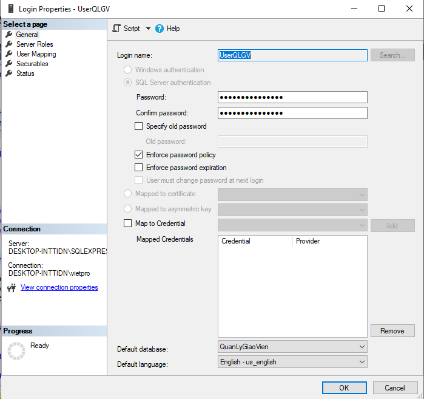

Kich vào phần "User Mapping"

Bấm kích chuột vào database QuangLyGiaoVien

Ở phần dưới "Database role menbership for master" , chon hết checkbox để phân quyền cho database

Sau đó bấm "OK", như trong hình:

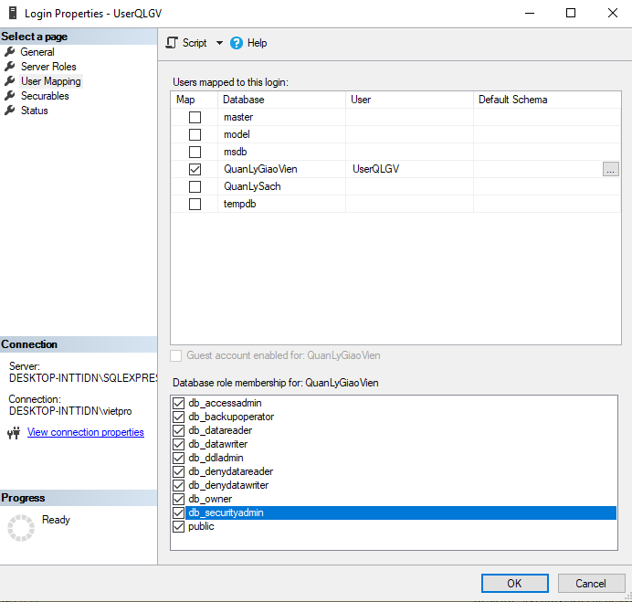

## Cấu hình lại file App.config

Mở project QuanLyGiaoVien -> file app.config : tại thẻ "<add>...</add>" ta điền chính xác thông tin đã tạo trên datadase trong đó:

Server: là tên server mặc định trong phần mền cơ sỡ dữ liệu

Database: là tên database QuanLyGiaoVien vừa tạo

User Id : là tên tài khoản vừa tạo, ở đây là "UserQLGV"

password : là mật khẩu bạn vừa tạo, ở đây là "viet12345"

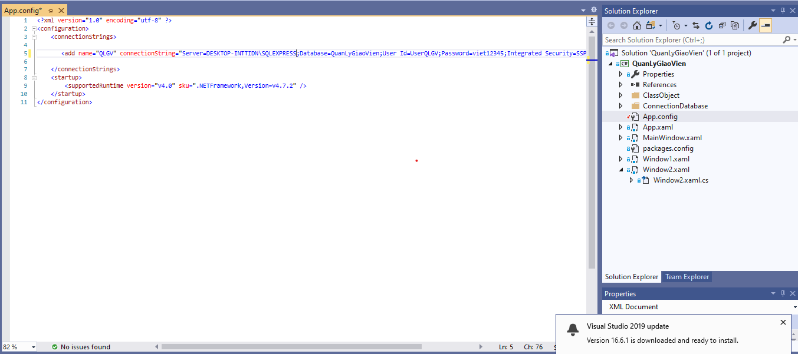

# Dao diện chương trình

## From đăng nhập

Nếu thông tin nhập vào là đúng thì phần sẽ hiển thị như hình dưới

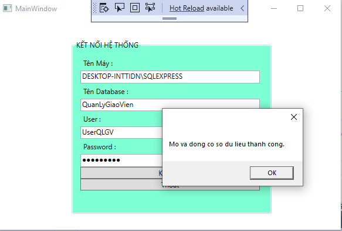

Nếu nhập sai hoặc chưa nhập thông tin sẽ đưa ra lỗi cảnh báo và bắt ta nhập lại

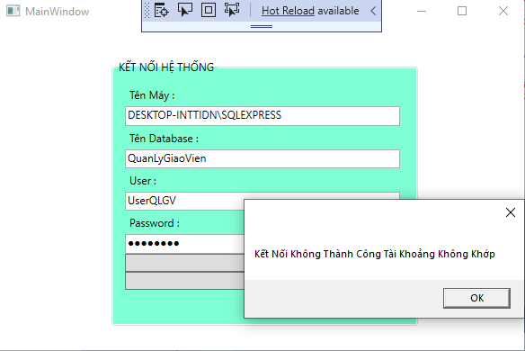

## From theo cấu trúc

Khi người dùng chọn một cơ sở thì chương trình hiển thị danh  sách đơn vị đào tạo thuộc cơ sở đó (sắp xếp theo tên đơn vị), chưa đơn vị nào được chọn từ ComboBox này, và không có GV nào hiển  thi  trong danh b. Người dùng chọn một đơn vị để xem danh sách giáo viên (thuộc đơn vị hiện tại) hiển thị trong danh sách phía dưới (thông tin hiển thị chỉ chứa tên gv, được đánh số thứ tự).

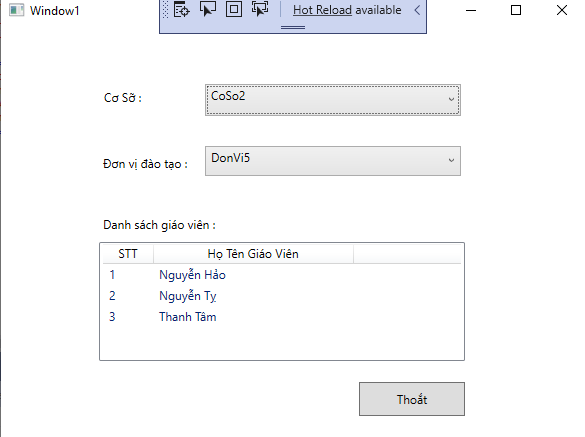

 -Khi người dùng chọn menu "Hiển thị thông tin chi tiết GV" hoặc double click vào một GV trong danh sách, chương trình sẽ hiển thị form   trên với thông tin giáo viên đang chọn. 
 
 - Người dùng nhấn nút quay lại để thoát khỏi form. 
 
 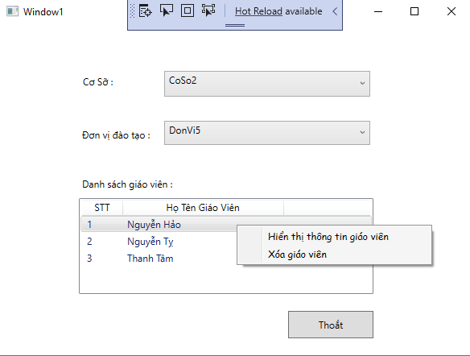
 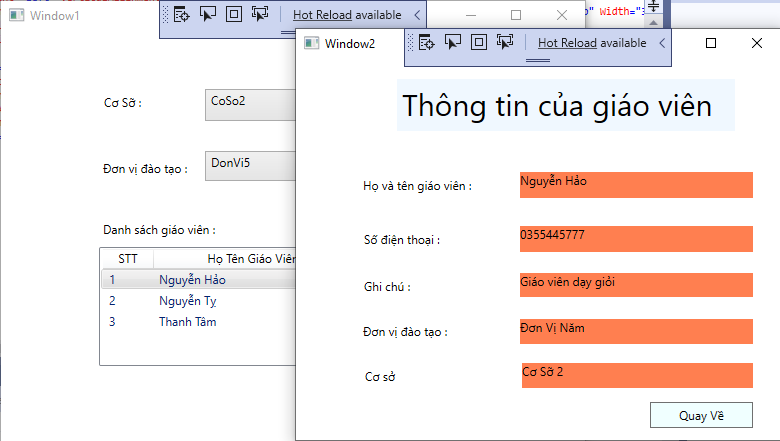
 
 
 -Khi người dùng chọn menu "Xóa GV đang chọn" chương trình sẽ xuất hiện hộp thoại xác nhận.
 
 -Nếu người dùng đồng ý, chương  trình sẽ xóa GV này ra khỏi database và cập nhật danh sách Trên màn hình). 
 
 -Nếu người dùng không đồng ý trở lại chương trình. 
 
 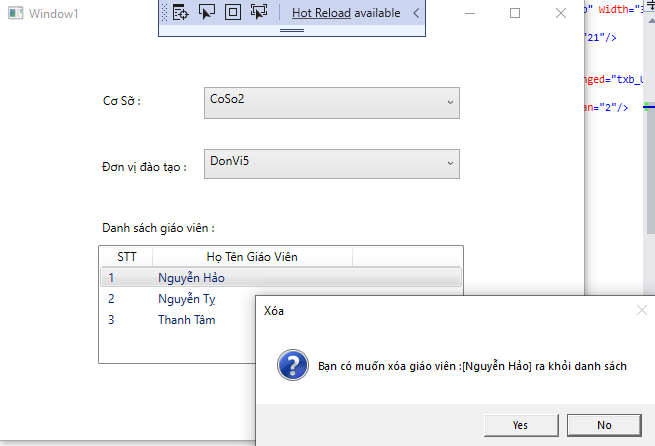
 
 -Khi người dùng chọn nut "Thoat" chương trình sẽ xuất hiện hộp thoại xác nhận.
 
 -Nếu người dùng đồng ý, chương  trình sẽ đóng lại ngay lập tức
 
 -Nếu người dùng không đồng ý trở lại chương trình. 
 
 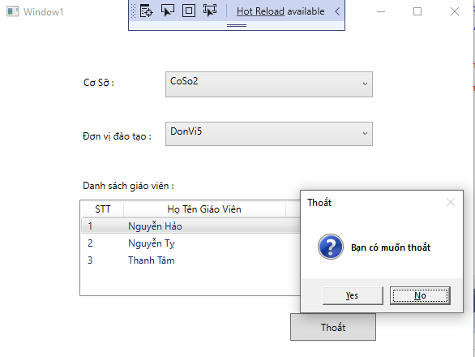
 
 
 
 
 
 
 

